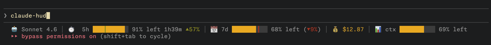

# claude-hud

A heads-up display for Claude Code. See your rate limits, model, context usage, and session cost — all in the status line.



## What you get

- **🤖 Model** — active model name, updates on every response
- **⏱️ 5h usage** — progress bar with pace marker showing if you're ahead or behind even consumption
- **📅 7d usage** — weekly limit with the same pace tracking
- **💰 Cost** — session spend so far
- **📊 Context** — how much of the context window is used

The pace marker (┃) on the usage bars shows where you *should* be if you spread usage evenly across the window. Red means you're consuming over pace, green means you have budget to spare.

## Install

Copy the prompt below and paste it into Claude Code. It contains the full source so Claude can install it directly, and you can also ask it questions about how it works, review it for security, or request changes before installing.

~~~
Install claude-hud: a statusline for Claude Code that shows rate limits, model, context, and cost.

Do the following steps:

1. Write the script below to ~/.claude/statusline-command.sh
2. Run: chmod +x ~/.claude/statusline-command.sh
3. Run: mkdir -p ~/.claude/statusline
4. Read ~/.claude/settings.json, then merge in the statusLine config below (preserve all existing settings):

```json
"statusLine": {
  "type": "command",
  "command": "~/.claude/statusline-command.sh",
  "padding": 0
}
```

5. Verify jq is installed (run: which jq). If missing, tell the user to install it with: brew install jq

Here is the full script to write to ~/.claude/statusline-command.sh:

```bash
#!/bin/bash

# Read input JSON from stdin
input=$(cat)

# Extract all input fields in a single jq call
IFS=$'\t' read -r model_name total_cost used_percentage <<< "$(jq -r '[
  .model.display_name // "",
  .cost.total_cost_usd // "",
  .context_window.used_percentage // ""
] | @tsv' <<< "$input")"

# Cache date +%s — used multiple times
NOW=$(date +%s)

# --- OAuth config ---
OAUTH_CLIENT_ID="9d1c250a-e61b-44d9-88ed-5944d1962f5e"
OAUTH_TOKEN_URL="https://platform.claude.com/v1/oauth/token"
KEYCHAIN_SERVICE="Claude Code-credentials"

# --- Token refresh ---
refresh_oauth_token() {
    local creds="$1"
    local refresh_token
    refresh_token=$(jq -r '.claudeAiOauth.refreshToken // empty' <<< "$creds" 2>/dev/null)
    [ -z "$refresh_token" ] && return 1

    local response
    response=$(curl -s --max-time 5 -X POST "$OAUTH_TOKEN_URL" \
        -H "Content-Type: application/json" \
        -d "{\"grant_type\":\"refresh_token\",\"refresh_token\":\"$refresh_token\",\"client_id\":\"$OAUTH_CLIENT_ID\"}" 2>/dev/null)

    local new_access_token new_refresh_token expires_in
    IFS=$'\t' read -r new_access_token new_refresh_token expires_in <<< "$(jq -r '[
      .access_token // "",
      .refresh_token // "",
      .expires_in // ""
    ] | @tsv' <<< "$response" 2>/dev/null)"

    [ -z "$new_access_token" ] && return 1

    local new_expires_at=""
    [ -n "$expires_in" ] && new_expires_at=$(( (NOW + expires_in) * 1000 ))

    local updated_creds
    updated_creds=$(jq \
        --arg at "$new_access_token" \
        --arg rt "${new_refresh_token:-$refresh_token}" \
        --arg ea "$new_expires_at" \
        '.claudeAiOauth.accessToken = $at |
         .claudeAiOauth.refreshToken = (if $rt != "" then $rt else .claudeAiOauth.refreshToken end) |
         (if $ea != "" then .claudeAiOauth.expiresAt = ($ea | tonumber) else . end)' <<< "$creds" 2>/dev/null)

    if [ -n "$updated_creds" ]; then
        security delete-generic-password -s "$KEYCHAIN_SERVICE" >/dev/null 2>&1
        security add-generic-password -s "$KEYCHAIN_SERVICE" -a "$KEYCHAIN_SERVICE" -w "$updated_creds" 2>/dev/null
    fi
    echo "$new_access_token"
}

# --- Decode keychain credentials ---
decode_keychain_creds() {
    local raw="$1"
    if [[ "$raw" =~ ^[0-9a-f]+$ ]]; then
        xxd -r -p <<< "$raw" 2>/dev/null
    else
        echo "$raw"
    fi
}

# --- Fetch usage from API ---
get_usage_limits() {
    local raw_creds
    raw_creds=$(security find-generic-password -s "$KEYCHAIN_SERVICE" -a "$(whoami)" -w 2>/dev/null)
    [ -z "$raw_creds" ] && raw_creds=$(security find-generic-password -s "$KEYCHAIN_SERVICE" -w 2>/dev/null)
    [ -z "$raw_creds" ] && return 1

    local creds
    creds=$(decode_keychain_creds "$raw_creds")

    local token expires_at
    IFS=$'\t' read -r token expires_at <<< "$(jq -r '[
      .claudeAiOauth.accessToken // .accessToken // "",
      .claudeAiOauth.expiresAt // ""
    ] | @tsv' <<< "$creds" 2>/dev/null)"
    [ -z "$token" ] && return 1

    # Check expiry
    if [ -n "$expires_at" ]; then
        local now_ms=$(( NOW * 1000 ))
        if [ "$now_ms" -ge "$expires_at" ]; then
            token=$(refresh_oauth_token "$creds")
            [ -z "$token" ] && return 1
        fi
    fi

    local response
    response=$(curl -s --max-time 3 \
        -H "Authorization: Bearer $token" \
        -H "anthropic-beta: oauth-2025-04-20" \
        "https://api.anthropic.com/api/oauth/usage" 2>/dev/null)

    # Retry on auth error
    local error_type
    error_type=$(jq -r '.error.type // empty' <<< "$response" 2>/dev/null)
    if [ "$error_type" = "authentication_error" ]; then
        raw_creds=$(security find-generic-password -s "$KEYCHAIN_SERVICE" -a "$(whoami)" -w 2>/dev/null)
        [ -z "$raw_creds" ] && raw_creds=$(security find-generic-password -s "$KEYCHAIN_SERVICE" -w 2>/dev/null)
        creds=$(decode_keychain_creds "$raw_creds")
        token=$(refresh_oauth_token "$creds")
        [ -z "$token" ] && return 1
        response=$(curl -s --max-time 3 \
            -H "Authorization: Bearer $token" \
            -H "anthropic-beta: oauth-2025-04-20" \
            "https://api.anthropic.com/api/oauth/usage" 2>/dev/null)
    fi
    echo "$response"
}

# --- Parse ISO 8601 to epoch (pure bash string manipulation, no sed) ---
parse_epoch() {
    local iso="$1"
    # Strip fractional seconds and normalize timezone for macOS date
    local clean="${iso%%.*}"                  # remove .nnnnn
    local tz="${iso##*+}"; tz="${tz##*-}"     # get timezone part
    if [[ "$iso" == *"+"* ]]; then
        local tzpart="+${iso##*+}"
        tzpart="${tzpart/:/}"                 # +00:00 -> +0000
        clean="${clean}${tzpart}"
    elif [[ "$iso" == *"Z"* ]]; then
        clean="${clean/Z/}+0000"
    fi
    local epoch
    epoch=$(date -j -f "%Y-%m-%dT%H:%M:%S%z" "$clean" "+%s" 2>/dev/null)
    [ -z "$epoch" ] && epoch=$(python3 -c "from datetime import datetime; print(int(datetime.fromisoformat('$iso'.replace('Z','+00:00')).timestamp()))" 2>/dev/null)
    echo "$epoch"
}

# --- Smooth progress bar with fractional blocks ---
create_progress_bar() {
    local remaining=$1 bar_length=${2:-10} expected_remaining=${3:-}
    local fracs=("█" "▉" "▊" "▋" "▌" "▍" "▎" "▏")

    local total_eighths=$(( remaining * bar_length * 8 / 100 ))
    (( total_eighths > bar_length * 8 )) && total_eighths=$(( bar_length * 8 ))
    local full=$(( total_eighths / 8 )) frac=$(( total_eighths % 8 ))

    # Colors
    local track='\033[48;5;238m' rst='\033[0m'
    local fill='\033[38;5;214m'
    (( remaining <= 20 )) && fill='\033[31m'

    # Pace marker position
    local marker_pos=-1 marker_fg=""
    if [ -n "$expected_remaining" ]; then
        marker_pos=$(( expected_remaining * bar_length / 100 ))
        (( marker_pos >= bar_length )) && marker_pos=$(( bar_length - 1 ))
        if (( remaining < expected_remaining )); then
            marker_fg='\033[31m'
        else
            marker_fg='\033[32m'
        fi
    fi

    # Build bar string
    local bar="" i
    for ((i=0; i<bar_length; i++)); do
        if (( i == marker_pos )); then
            # Match background to zone: orange in filled, gray in empty
            if (( i < full || (i == full && frac > 0) )); then
                bar+="\033[48;5;214m${marker_fg}┃${rst}"
            else
                bar+="${track}${marker_fg}┃${rst}"
            fi
        elif (( i < full )); then
            bar+="${track}${fill}█${rst}"
        elif (( i == full )) && (( frac > 0 )); then
            bar+="${track}${fill}${fracs[$((8 - frac))]}${rst}"
        else
            bar+="${track} ${rst}"
        fi
    done
    printf '%b' "$bar"
}

# --- Cached usage fetch (2 min TTL) ---
USAGE_CACHE="$HOME/.claude/statusline/usage-cache.json"
CACHE_MAX_AGE=120

get_cached_usage() {
    if [ -f "$USAGE_CACHE" ]; then
        local cache_mtime
        cache_mtime=$(stat -f %m "$USAGE_CACHE" 2>/dev/null)
        if [ -n "$cache_mtime" ] && (( NOW - cache_mtime < CACHE_MAX_AGE )); then
            printf '%s' "$(<"$USAGE_CACHE")"
            return 0
        fi
    fi
    local data
    data=$(get_usage_limits)
    if [ -n "$data" ] && jq -e '.five_hour' <<< "$data" >/dev/null 2>&1; then
        echo "$data" > "$USAGE_CACHE"
    fi
    echo "$data"
}

# ============================================================
# Main rendering
# ============================================================

usage_data=$(get_cached_usage)

# Extract all usage fields in a single jq call
IFS=$'\t' read -r five_hour_util five_hour_reset seven_day_util seven_day_reset <<< "$(jq -r '[
  .five_hour.utilization // "",
  .five_hour.resets_at // "",
  .seven_day.utilization // "",
  .seven_day.resets_at // ""
] | @tsv' <<< "$usage_data" 2>/dev/null)"

# --- 5-hour bar with pace marker ---
five_hour_info=""
if [ -n "$five_hour_util" ]; then
    five_used=$(printf "%.0f" "$five_hour_util")
    five_remaining=$(( 100 - five_used ))

    time_left="" five_expected_remaining="" five_deficit_info=""
    if [ -n "$five_hour_reset" ]; then
        reset_epoch=$(parse_epoch "$five_hour_reset")
        if [ -n "$reset_epoch" ]; then
            diff=$(( reset_epoch - NOW ))
            if (( diff <= 0 )); then
                time_left="now"
            else
                h=$(( diff / 3600 )); m=$(( (diff % 3600) / 60 ))
                (( h > 0 )) && time_left="${h}h${m}m" || time_left="${m}m"
            fi
            # Pace: 5h window = 18000s
            elapsed=$(( NOW - (reset_epoch - 18000) ))
            if (( elapsed > 0 && elapsed < 18000 )); then
                expected_used=$(( elapsed * 100 / 18000 ))
                five_expected_remaining=$(( 100 - expected_used ))
                deficit=$(( five_expected_remaining - five_remaining ))
                if (( deficit > 0 )); then
                    five_deficit_info=$(printf '\033[31m%d%% over pace\033[0m' "$deficit")
                elif (( deficit < 0 )); then
                    five_deficit_info=$(printf '\033[32m%d%% ahead\033[0m' "$(( -deficit ))")
                fi
            fi
        fi
    fi

    five_bar=$(create_progress_bar "$five_remaining" 10 "$five_expected_remaining")

    # Build display: bar + remaining + optional time + optional deficit
    local_parts="${five_remaining}% left"
    [ -n "$time_left" ] && local_parts="${local_parts} ${time_left}"
    [ -n "$five_deficit_info" ] && local_parts="${local_parts} ${five_deficit_info}"
    five_hour_info=$(printf "⏱️  5h %s %s" "$five_bar" "$local_parts")
fi

# --- 7-day bar with pace marker ---
seven_day_info=""
if [ -n "$seven_day_util" ]; then
    seven_used=$(printf "%.0f" "$seven_day_util")
    seven_remaining=$(( 100 - seven_used ))

    expected_remaining="" deficit_info=""
    if [ -n "$seven_day_reset" ]; then
        reset_epoch=$(parse_epoch "$seven_day_reset")
        if [ -n "$reset_epoch" ]; then
            elapsed=$(( NOW - (reset_epoch - 604800) ))
            if (( elapsed > 0 && elapsed < 604800 )); then
                expected_used=$(( elapsed * 100 / 604800 ))
                expected_remaining=$(( 100 - expected_used ))
                deficit=$(( expected_remaining - seven_remaining ))
                if (( deficit > 0 )); then
                    deficit_info=$(printf '\033[31m%d%% over pace\033[0m' "$deficit")
                elif (( deficit < 0 )); then
                    deficit_info=$(printf '\033[32m%d%% ahead\033[0m' "$(( -deficit ))")
                fi
            fi
        fi
    fi

    seven_bar=$(create_progress_bar "$seven_remaining" 10 "$expected_remaining")
    if [ -n "$deficit_info" ]; then
        seven_day_info=$(printf "📅 7d %s %s%% left (%s)" "$seven_bar" "$seven_remaining" "$deficit_info")
    else
        seven_day_info=$(printf "📅 7d %s %s%% left" "$seven_bar" "$seven_remaining")
    fi
fi

# --- Context bar ---
context_info=""
if [ -n "$used_percentage" ]; then
    ctx_remaining=$(( 100 - $(printf "%.0f" "$used_percentage") ))
    context_bar=$(create_progress_bar "$ctx_remaining" 10)
    context_info=$(printf "📊 ctx %s %s%% left" "$context_bar" "$ctx_remaining")
fi

# --- Cost ---
cost_info=""
[ -n "$total_cost" ] && cost_info=$(printf "💰 \033[33m\$%.2f\033[0m" "$total_cost")

# --- Assemble status line ---
status_parts=()
[ -n "$model_name" ] && status_parts+=("🤖 $model_name")
[ -n "$five_hour_info" ] && status_parts+=("$five_hour_info")
[ -n "$seven_day_info" ] && status_parts+=("$seven_day_info")
[ -n "$cost_info" ] && status_parts+=("$cost_info")
[ -n "$context_info" ] && status_parts+=("$context_info")

sep=$'\033[2m│\033[0m'
output=""
for i in "${!status_parts[@]}"; do
    (( i == 0 )) && output="${status_parts[$i]}" || output="$output $sep ${status_parts[$i]}"
done

echo -e "$output"
```
~~~

## Requirements

- macOS (uses Keychain for auth, `date -j` for time parsing)
- `jq` (`brew install jq`)
- Claude Code with Pro or Max subscription (usage API requires OAuth login)
